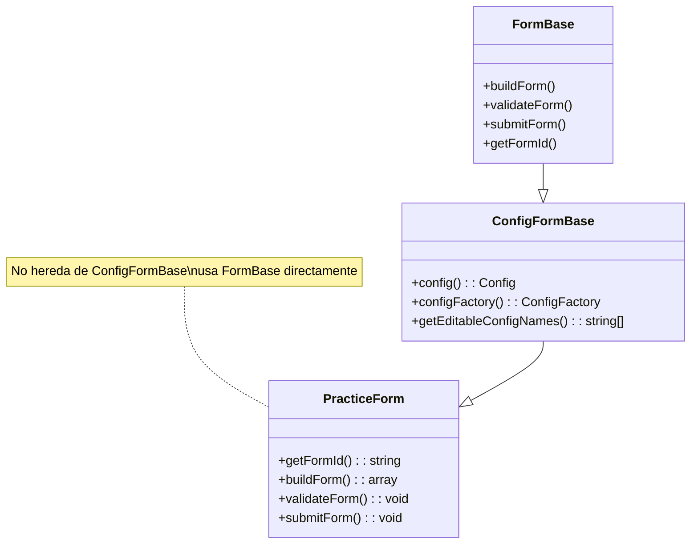
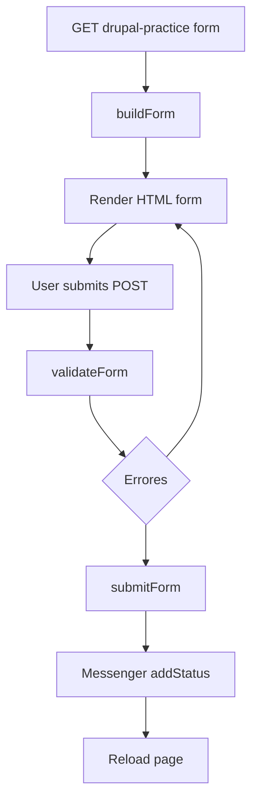
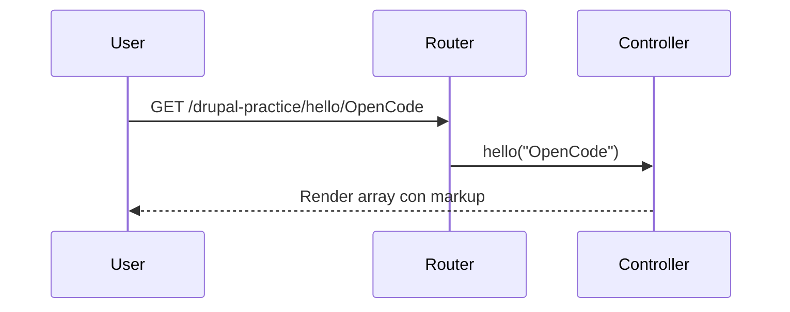
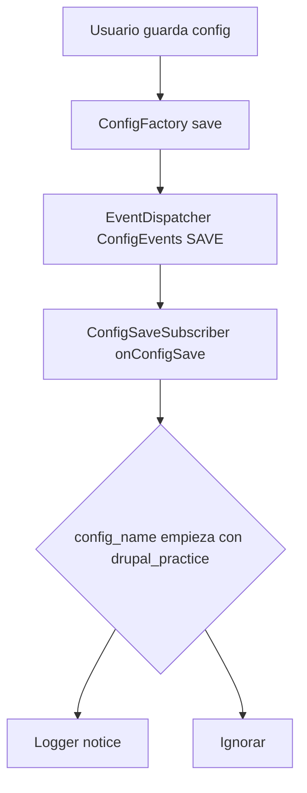
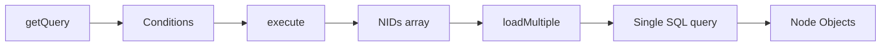
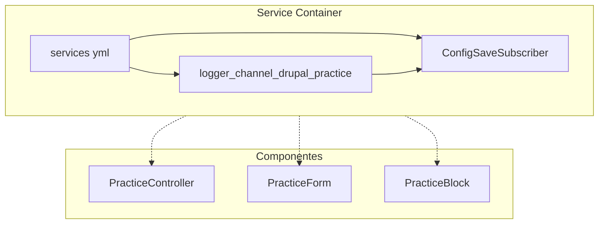

# Drupal Practice Module

Módulo de ejercicios básicos para aprender los fundamentos del desarrollo en Drupal 10/11. Cada componente demuestra una API o concepto core de forma aislada y didáctica.

---

## Tabla de contenidos

1. [Arquitectura general](#arquitectura-general)
2. [Controller: Rutas y parámetros](#controller-rutas-y-parametros)
3. [Render Arrays](#render-arrays)
4. [Form API](#form-api)
5. [Plugin de Bloque](#plugin-de-bloque)
6. [Event Subscriber](#event-subscriber)
7. [Integración con menú](#integracion-con-menu)
8. [Hook Views Query Alter](#hook-views-query-alter)
9. [Diagramas de flujo](#diagramas-de-flujo)
10. [Decisiones de diseño y buenas prácticas](#decisiones-de-diseno-y-buenas-practicas)
11. [Cómo probar](#como-probar)

---

## Arquitectura general

```
drupal_practice/
├── drupal_practice.info.yml          # Metadatos + dependencias
├── drupal_practice.routing.yml       # Definición de rutas
├── drupal_practice.services.yml      # Servicios (logger channel + event subscriber)
├── drupal_practice.links.menu.yml    # Enlace en menú principal
├── drupal_practice.module            # Hooks procedurales
└── src/
    ├── Controller/PracticeController.php
    ├── Form/PracticeForm.php
    ├── Plugin/Block/PracticeBlock.php
    └── EventSubscriber/ConfigSaveSubscriber.php
```

**Dependencias declaradas** (`.info.yml`):
- `block` — Requerido para `BlockBase` y discovery de plugins de bloque
- `logger` — Requerido para canal de log propio (`logger.channel.drupal_practice`)
- `views` — Requerido para `hook_views_query_alter()`

---

## Controller: Rutas y parámetros

### Archivo: `src/Controller/PracticeController.php`

### Rutas definidas (`routing.yml`)

```yaml
drupal_practice.hello:
  path: '/drupal-practice/hello/{name}'
  defaults:
    _controller: '\Drupal\drupal_practice\Controller\PracticeController::hello'
    _title: 'Hello @name'
  requirements:
    _permission: 'access content'

drupal_practice.render_array:
  path: '/drupal-practice/render-array'
  defaults:
    _controller: '\Drupal\drupal_practice\Controller\PracticeController::renderArray'
    _title: 'Example Render Array'
  requirements:
    _permission: 'access content'
```

### Método `hello(string $name)`

```php
public function hello(string $name): array {
  return [
    '#markup' => $this->t(
      'Hello @name, this message comes from a Drupal Controller.',
      ['@name' => $name]
    ),
  ];
}
```

**¿Por qué así?**
- **ParamConverter automático**: Drupal convierte `{name}` en el argumento `$name` del método por coincidencia de nombre.
- **Retorno render array**: Los controllers **siempre** devuelven render arrays (`#markup`, `#theme`, etc.), nunca HTML directo ni `echo`.
- **`$this->t()` con placeholders**: Usa `@name` (placeholder seguro, escapa HTML) en lugar de concatenación. Previene XSS y permite traducción.
- **Tipado estricto**: `string $name` — PHP 8+ lo valida en runtime; IDE lo usa para autocompletado.

---

## Render Arrays

### Método `renderArray()`

```php
public function renderArray(): array {
  return [
    'intro' => [
      '#type' => 'container',
      'title' => [
        '#type' => 'html_tag',
        '#tag' => 'h2',
        '#value' => $this->t('Technologies I study or use'),
      ],
      'description' => [
        '#markup' => $this->t('This content is built with render arrays')
      ]
    ],
    'technologies' => [
      '#theme' => 'item_list',
      '#title' => $this->t('Technologies'),
      '#items' => [
        $this->t('Drupal'),
        $this->t('Lit'),
        $this->t('Angular'),
        $this->t('NestJS'),
      ],
    ],
    'link' => [
      '#type' => 'link',
      '#title' => $this->t('Go to Drupal.org'),
      '#url' => Url::fromUri('https://www.drupal.org'),
      '#attributes' => ['target' => '_blank'],
    ],
  ];
}
```

**Conceptos clave demostrados:**

| Elemento | Propósito |
|----------|-----------|
| `#type => 'container'` | Wrapper genérico (renderiza `<div>`). Agrupa hijos sin semántica HTML propia. |
| `#type => 'html_tag'` | Etiqueta HTML arbitraria (`h2`, `span`, `section`, etc.). Útil para encabezados semánticos. |
| `#theme => 'item_list'` | Delega renderizado a plantilla Twig (`item-list.html.twig`). Recibe `#items` y opcional `#title`. |
| `#type => 'link'` | Genera `<a>` con `#url` (objeto `Url`) y atributos. Maneja cache tags, idioma, ruta activa automáticamente. |

---

## Form API

### Archivo: `src/Form/PracticeForm.php`

### Ruta (`routing.yml`)

```yaml
drupal_practice.form:
  path: '/drupal-practice/form'
  defaults:
    _form: '\Drupal\drupal_practice\Form\PracticeForm'
    _title: 'Form Example'
  requirements:
    _permission: 'access content'
```

### Estructura del formulario

```php
public function buildForm(array $form, FormStateInterface $form_state): array {
  $form['name'] = [
    '#type' => 'textfield',
    '#title' => $this->t('Name'),
    '#required' => TRUE,
  ];

  $form['email'] = [
    '#type' => 'email',
    '#title' => $this->t('Email'),
    '#required' => TRUE,
  ];

  $form['technology'] = [
    '#type' => 'select',
    '#title' => $this->t('Favorite technology'),
    '#options' => [
      'drupal' => $this->t('Drupal'),
      'lit' => $this->t('Lit'),
      'angular' => $this->t('Angular'),
      'nestjs' => $this->t('NestJS'),
      'react' => $this->t('React'),
    ],
    '#required' => TRUE,
  ];

  $form['age'] = [
    '#type' => 'number',
    '#title' => $this->t('Age'),
    '#required' => TRUE,
    '#min' => 18,
    '#max' => 120,
  ];

  $form['actions']['submit'] = [
    '#type' => 'submit',
    '#value' => $this->t('Submit'),
  ];

  return $form;
}
```

### Validación (`validateForm`)

```php
public function validateForm(array &$form, FormStateInterface $form_state): void {
  $values = $form_state->getValues();

  if ($values['age'] < 18) {
    $form_state->setErrorByName('age', $this->t('You must be at least 18 years old'));
  }

  $email = $values['email'];
  if (!filter_var($email, FILTER_VALIDATE_EMAIL)) {
    $form_state->setErrorByName('email', $this->t('Invalid email format'));
  }
}
```

### Envío (`submitForm`)

```php
public function submitForm(array &$form, FormStateInterface $form_state): void {
  $name = $form_state->getValue('name');
  $technology = $form_state->getValue('technology');

  $this->messenger()->addStatus(
    $this->t('Hi @name, your favorite technology is @technology.', [
      '@name' => $name,
      '@technology' => $technology,
    ])
  );
}
```

---

## Plugin de Bloque

### Archivo: `src/Plugin/Block/PracticeBlock.php`

```php
#[Block(
  id: 'drupal_practice_block',
  admin_label: new TranslatableMarkup('Drupal Practice Block'),
  category: new TranslatableMarkup('Custom')
)]
class PracticeBlock extends BlockBase {
  public function build(): array {
    return [
      '#type' => 'container',
      'title' => [
        '#type' => 'html_tag',
        '#tag' => 'h2',
        '#value' => $this->t('My first plugin'),
      ],
      'content' => [
        '#markup' => $this->t('Custom block content'),
      ],
    ];
  }
}
```

---

## Event Subscriber

### Archivo: `src/EventSubscriber/ConfigSaveSubscriber.php`

```php
class ConfigSaveSubscriber implements EventSubscriberInterface {
  protected LoggerInterface $logger;

  public function __construct(LoggerInterface $logger) {
    $this->logger = $logger;
  }

  public static function getSubscribedEvents(): array {
    return [
      ConfigEvents::SAVE => 'onConfigSave',
    ];
  }

  public function onConfigSave(ConfigCrudEvent $event): void {
    $config = $event->getConfig();
    $config_name = $config->getName();

    if (str_starts_with($config_name, 'drupal_practice.')) {
      $this->logger->notice('Configuration saved: @config', ['@config' => $config_name]);
    }
  }
}
```

### Registro del servicio (`services.yml`)

```yaml
services:
  Drupal\drupal_practice\EventSubscriber\ConfigSaveSubscriber:
    arguments:
      - '@logger.channel.drupal_practice'
    tags:
      - { name: event_subscriber }

  logger.channel.drupal_practice:
    parent: logger.channel_base
    arguments:
      - 'drupal_practice'
```

---

## Integración con menú

### Archivo: `drupal_practice.links.menu.yml`

```yaml
drupal_practice.form_menu:
  title: 'Drupal Practice'
  description: 'Ejercicios personalizados de Drupal'
  route_name: drupal_practice.form
  menu_name: main
  weight: 100
```

---

## Hook Views Query Alter

### Archivo: `drupal_practice.module`

```php
function drupal_practice_views_query_alter(ViewExecutable $view, QueryPluginBase $query): void {
  if ($view->id() !== 'practice_content') {
    return;
  }

  $query->addWhere(
    0,
    'node_field_data.nid',
    17,
    '<>'
  );
}
```

---

## Diagramas de flujo

### 1. Herencia de Formularios



### 2. Flujo Form API (GET → POST → Validate → Submit)



### 3. ParamConverter para {name} en ruta hello



### 4. Event Subscriber: ConfigEvents::SAVE con filtro



### 5. EntityQuery a loadMultiple (Optimización)



### 6. Inyección de Dependencias (Container a Componentes)



---

## Decisiones de diseño y buenas prácticas

### 1. Inyección de dependencias en todos los plugins/controladores/formularios
- `PracticeController::create()` inyecta servicios desde container
- `PracticeForm::create()` inyecta `entity_type.manager` (patrón listo)
- `PracticeBlock::create()` inyecta `form_builder`
- `ConfigSaveSubscriber` inyecta `LoggerInterface` (canal dedicado)

**Por qué:** Testabilidad, desacoplamiento, ciclo de vida gestionado por Drupal.

### 2. Namespace PSR-4
```
Drupal\drupal_practice\Controller
Drupal\drupal_practice\Form
Drupal\drupal_practice\Plugin\Block
Drupal\drupal_practice\EventSubscriber
```

### 3. Traducción (`$this->t()`) en **todos** los strings user-facing

### 4. Tipado estricto (PHP 8.1+)

### 5. Cacheabilidad implícita

### 6. Separación de responsabilidades

| Componente | Responsabilidad única |
|------------|----------------------|
| Controller | HTTP request → render array |
| Form | Input → validate → submit → mensaje |
| Block | Contenido reutilizable en regiones |
| EventSubscriber | Reacción a eventos del sistema |
| Hook | Alteración procedural (views query) |

---

## Cómo probar cada componente

```bash
# Limpiar caché
fin exec drush cr

# 1. Controller hello
curl -I "http://task-concepts.docksal.site/drupal-practice/hello/OpenCode"

# 2. Render array
curl "http://task-concepts.docksal.site/drupal-practice/render-array"

# 3. Formulario
# Navegador: /drupal-practice/form

# 4. Bloque
# Admin: /admin/structure/block -> Place block -> Drupal Practice Block

# 5. Event subscriber
# Admin: /admin/config/system/site-information -> Guardar
# Logs: /admin/reports/dblog -> filtrar Type: drupal_practice
```

---

## Referencias

- [Drupal 10 Render API](https://www.drupal.org/docs/develop/drupal-apis/render-api)
- [Form API Reference](https://api.drupal.org/api/drupal/core%21lib%21Drupal%21Core%21Form%21form.api.php/group/form_api/10)
- [Block API](https://www.drupal.org/docs/8/creating-custom-modules/block-api)
- [Event Subscriber](https://www.drupal.org/docs/8/creating-custom-modules/subscribing-to-and-dispatching-events)
- [Views Hooks](https://api.drupal.org/api/drupal/core%21modules%21views%21views.api.php/group/views_hooks/10)