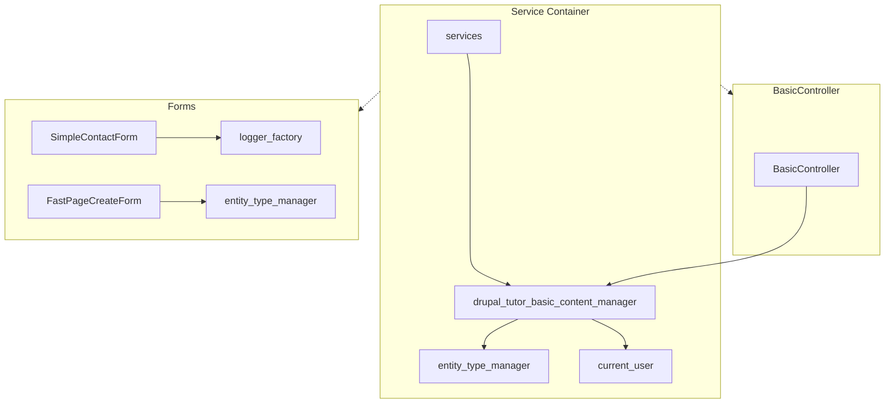
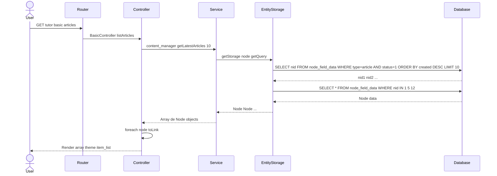
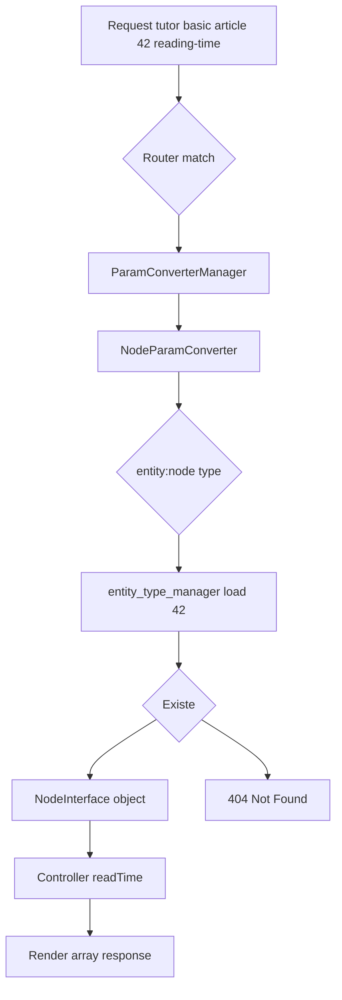
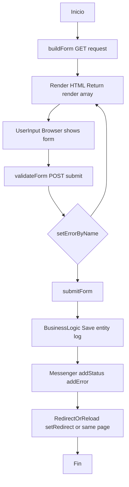
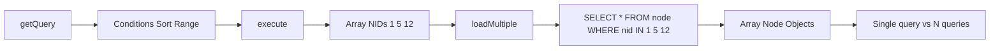
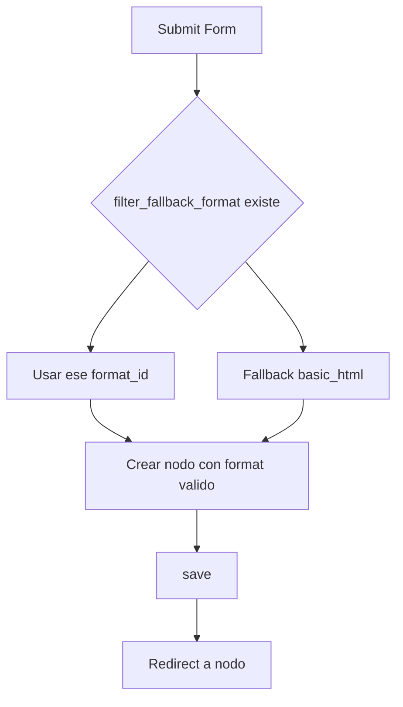

# Drupal Tutor Basic Module

Módulo del **Sprint 1** que demuestra los fundamentos del desarrollo en Drupal: servicios personalizados, inyección de dependencias, EntityQuery, ParamConverter, render arrays y Form API.

---

## Tabla de contenidos

1. [Arquitectura general](#arquitectura-general)
2. [Servicio: ContentManagerService](#servicio-contentmanagerservice)
3. [Controller: BasicController](#controller-basiccontroller)
4. [Formularios](#formularios)
5. [Rutas y ParamConverter](#rutas-y-paramconverter)
6. [Inyección de dependencias](#inyección-de-dependencias)
7. [Diagramas de flujo](#diagramas-de-flujo)
8. [Decisiones de diseño](#decisiones-de-diseño)
9. [Cómo probar](#cómo-probar)

---

## Arquitectura general

```
drupal_tutor_basic/
├── drupal_tutor_basic.info.yml           # Metadatos + dependencias
├── drupal_tutor_basic.routing.yml        # 5 rutas (controllers + forms)
├── drupal_tutor_basic.services.yml       # Servicio personalizado
└── src/
    ├── Controller/BasicController.php    # 3 métodos controller
    ├── Form/
    │   ├── SimpleContactForm.php         # Form contacto + logging
    │   └── FastPageCreateForm.php        # Crea nodos page
    └── Services/ContentManagerService.php # Lógica de negocio centralizada
```

### Dependencias (`.info.yml`)

```yaml
dependencies:
  - node      # EntityQuery sobre 'node', creación de nodos 'page'
  - user      # EntityQuery sobre 'user' para estadísticas
```

---

## Servicio: ContentManagerService

### Archivo: `src/Services/ContentManagerService.php`

```php
class ContentManagerService {
  protected $entityTypeManager;
  protected $currentUser;

  public function __construct(EntityTypeManagerInterface $entityTypeManager,
    AccountProxyInterface $currentUser) {
    $this->entityTypeManager = $entityTypeManager;
    $this->currentUser = $currentUser;
  }

  public function getLatestArticles(int $limit = 5): array { ... }
  public function calculateReadingTime(string $text): int { ... }
  public function getSiteStats(): array { ... }
}
```

### Registro del servicio (`services.yml`)

```yaml
services:
  drupal_tutor_basic.content_manager:
    class: Drupal\drupal_tutor_basic\Services\ContentManagerService
    arguments: ['@entity_type.manager', '@current_user']
```

### Método 1: `getLatestArticles(int $limit)`

```php
public function getLatestArticles(int $limit = 5): array {
  $storage = $this->entityTypeManager->getStorage('node');
  $nids = $storage->getQuery()
    ->condition('type', 'article')
    ->condition('status', 1)
    ->sort('created', 'DESC')
    ->range(0, $limit)
    ->accessCheck(TRUE)
    ->execute();
  return $storage->loadMultiple($nids);
}
```

| Paso | Explicación |
|------|-------------|
| `getStorage('node')` | Almacenamiento de entidades `node` (SQL por defecto) |
| `getQuery()` | `EntityQueryInterface` — query builder seguro, DB-agnostic |
| `condition('type', 'article')` | Filtra por bundle (content type) |
| `condition('status', 1)` | Solo publicados |
| `sort('created', 'DESC')` | Más recientes primero |
| `range(0, $limit)` | Paginación: offset 0, límite `$limit` |
| `accessCheck(TRUE)` | **Crítico**: añade `node_access` tags |
| `execute()` | Devuelve array de NIDs `[1, 5, 12, ...]` |
| `loadMultiple($nids)` | Carga entidades completadas en una query |

### Método 2: `calculateReadingTime(string $text)`

```php
public function calculateReadingTime(string $text): int {
  $words = str_word_count(strip_tags($text));
  $minutes = ceil($words / 200);
  return $minutes;
}
```

### Método 3: `getSiteStats()`

```php
public function getSiteStats(): array {
  $total_users = $this->entityTypeManager->getStorage('user')->getQuery()
    ->accessCheck(FALSE)->count()->execute();
  $total_pages = $this->entityTypeManager->getStorage('node')->getQuery()
    ->condition('type', 'page')->accessCheck(FALSE)->count()->execute();
  return ['total_users' => $total_users, 'total_pages' => $total_pages];
}
```

---

## Controller: BasicController

### Archivo: `src/Controller/BasicController.php`

```php
class BasicController extends ControllerBase {
  protected ContentManagerService $contentManagerService;

  public function __construct(ContentManagerService $contentManagerService) {
    $this->contentManagerService = $contentManagerService;
  }

  public static function create(ContainerInterface $container) {
    return new static($container->get('drupal_tutor_basic.content_manager'));
  }

  public function listArticles() { ... }
  public function readTime(NodeInterface $node) { ... }
  public function getSiteStatistics() { ... }
}
```

### Método 1: `listArticles()`

```php
public function listArticles() {
  $nodes = $this->contentManagerService->getLatestArticles(10);
  $items = [];
  foreach ($nodes as $item_node) {
    $items[] = $item_node->toLink()->toString();
  }
  return [
    '#theme' => 'item_list',
    '#items' => $items,
    '#title' => $this->t('Latest Articles'),
    '#empty' => $this->t('No articles found.'),
  ];
}
```

### Método 2: `readTime(NodeInterface $node)` — **ParamConverter**

```php
public function readTime(NodeInterface $node) {
  if (!$node->hasField('body') || $node->get('body')->isEmpty()) {
    return ['#markup' => $this->t('This node does not have a body field.')];
  }
  $body = $node->get('body')->value ?? '';
  $reading_time = $this->contentManagerService->calculateReadingTime($body);
  $safe_body = Xss::filter($body, ['p', 'br', 'strong', 'em', 'ul', 'ol', 'li']);

  return [
    '#markup' => '<p><strong>' . $this->t('Title:') . '</strong> ' . $node->getTitle() . '<br>' . $safe_body . '</p><p>' . $this->t('Read time: @minutes minutes', ['@minutes' => $reading_time]) . '</p>',
  ];
}
```

**Ruta en `routing.yml`:**
```yaml
drupal_tutor_basic.node_reading_time:
  path: 'tutor/basic/article/{node}/reading-time'
  defaults:
    _controller: '\Drupal\drupal_tutor_basic\Controller\BasicController::readTime'
  requirements:
    _permission: 'access content'
  options:
    parameters:
      node:
        type: entity:node
```

---

## Formularios

### 1. SimpleContactForm

**Archivo:** `src/Form/SimpleContactForm.php`

```php
class SimpleContactForm extends FormBase {
  protected $logger;

  public function __construct(LoggerChannelFactoryInterface $loggerFactory) {
    $this->logger = $loggerFactory->get('drupal_tutor_basic');
  }

  public static function create(ContainerInterface $container) {
    return new static($container->get('logger.factory'));
  }

  public function buildForm(array $form, FormStateInterface $form_state) {
    $form['name'] = ['#type' => 'textfield', '#title' => $this->t('Your Name'), '#required' => TRUE];
    $form['email'] = ['#type' => 'email', '#title' => $this->t('Email Address'), '#required' => TRUE];
    $form['message'] = ['#type' => 'textarea', '#title' => $this->t('Message or Suggestion'), '#required' => TRUE];
    $form['actions']['submit'] = ['#type' => 'submit', '#value' => $this->t('Send Message'), '#button_type' => 'primary'];
    return $form;
  }

  public function validateForm(array &$form, FormStateInterface $form_state) {
    $email = $form_state->getValue('email');
    if (!filter_var($email, FILTER_VALIDATE_EMAIL)) {
      $form_state->setErrorByName('email', $this->t('Invalid email format'));
    }
  }

  public function submitForm(array &$form, FormStateInterface $form_state) {
    $name = $form_state->getValue('name');
    $email = $form_state->getValue('email');
    $this->logger->info('New contact message from @name (@email)', ['@name' => $name, '@email' => $email]);
    $this->messenger()->addStatus($this->t('Thanks @name for your message', ['@name' => $name]));
  }
}
```

### 2. FastPageCreateForm

**Archivo:** `src/Form/FastPageCreateForm.php`

```php
class FastPageCreateForm extends FormBase {
  protected EntityTypeManagerInterface $entityTypeManager;

  public function __construct(EntityTypeManagerInterface $entity_type_manager) {
    $this->entityTypeManager = $entity_type_manager;
  }

  public static function create(ContainerInterface $container) {
    return new static($container->get('entity_type.manager'));
  }

  public function buildForm(array $form, FormStateInterface $form_state) {
    $form['title'] = ['#type' => 'textfield', '#title' => $this->t('Page Title'), '#required' => TRUE];
    $form['body'] = ['#type' => 'textarea', '#title' => $this->t('Page Body'), '#required' => TRUE];
    $form['submit'] = ['#type' => 'submit', '#value' => $this->t('Create and publish')];
    return $form;
  }

  public function validateForm(array &$form, FormStateInterface $form_state) {
    $title = $form_state->getValue('title');
    if (strlen($title) < 5) {
      $form_state->setErrorByName('title', $this->t('Page title must be at least 5 characters long'));
    }
  }

  public function submitForm(array &$form, FormStateInterface $form_state) {
    $fallback_format = filter_fallback_format();
    $format_id = $fallback_format ? $fallback_format->id() : 'basic_html';

    $node = $this->entityTypeManager->getStorage('node')->create([
      'type' => 'page',
      'title' => $form_state->getValue('title'),
      'body' => ['value' => $form_state->getValue('body'), 'format' => $format_id],
      'status' => 1,
    ]);
    $node->save();

    $this->messenger()->addStatus($this->t('Page "@title" has been created. (ID: @nid)', [
      '@title' => $node->getTitle(), '@nid' => $node->id(),
    ]));

    $form_state->setRedirect('entity.node.canonical', ['node' => $node->id()]);
  }
}
```

---

## Rutas y ParamConverter

### `routing.yml` completo

```yaml
drupal_tutor_basic.latest_articles:
  path: 'tutor/basic/articles'
  defaults:
    _controller: '\Drupal\drupal_tutor_basic\Controller\BasicController::listArticles'
    _title: 'Latest Articles'
  requirements:
    _permission: 'access content'

drupal_tutor_basic.node_reading_time:
  path: 'tutor/basic/article/{node}/reading-time'
  defaults:
    _controller: '\Drupal\drupal_tutor_basic\Controller\BasicController::readTime'
    _title: 'Reading Time'
  requirements:
    _permission: 'access content'
  options:
    parameters:
      node:
        type: entity:node

drupal_tutor_basic.site_statistics:
  path: 'tutor/basic/site-statistics'
  defaults:
    _controller: '\Drupal\drupal_tutor_basic\Controller\BasicController::getSiteStatistics'
    _title: 'Site Statistics'
  requirements:
    _role: 'administrator'

drupal_tutor_basic.contact_form:
  path: 'tutor/basic/contact-form'
  defaults:
    _form: '\Drupal\drupal_tutor_basic\Form\SimpleContactForm'
    _title: 'Contact Form'
  requirements:
    _permission: 'access content'

drupal_tutor_basic.create_page:
  path: 'tutor/basic/create-page'
  defaults:
    _form: '\Drupal\drupal_tutor_basic\Form\FastPageCreateForm'
    _title: 'Create Fast Page'
  requirements:
    _permission: 'create page content'
    _role: 'administrator'
```

| Ruta | `_permission` | `_role` | Lógica |
|------|---------------|---------|--------|
| `latest_articles` | `access content` | — | Usuario con permiso |
| `node_reading_time` | `access content` | — | Igual |
| `site_statistics` | — | `administrator` | Solo rol admin |
| `contact_form` | `access content` | — | Público |
| `create_page` | `create page content` | `administrator` | **AND**: ambos |

---

## Inyección de dependencias

### Diagrama completo del contenedor



---

## Diagramas de flujo

### 1. Flujo completo: Request a Response



### 2. ParamConverter para node



### 3. Form API Lifecycle



### 4. EntityQuery a loadMultiple optimización



### 5. filter_fallback_format vs hardcoded



---

## Decisiones de diseño

### 1. Servicio centralizado (`ContentManagerService`)

| Controller directo | Servicio separado |
|--------------------|-------------------|
| Difícil de testear | Testable con mocks |
| Acoplado a HTTP | Reutilizable (CLI, Queue, REST) |
| Violación SRP | Single Responsibility Principle |

### 2. `accessCheck(TRUE)` vs `FALSE`

```php
// listArticles: usuario ve solo lo que puede
->accessCheck(TRUE)

// getSiteStats: admin ve todo
->accessCheck(FALSE)
```

### 3. ParamConverter implícito vs explícito

```yaml
# Implícito (funciona por convención {node})
parameters:
  node:
    type: entity:node

# Explícito para otros tipos
parameters:
  usuario:
    type: entity:user
  termino:
    type: entity:taxonomy_term
```

### 4. Formato de texto fallback

```php
// ANTES (problemático)
'format' => 'basic_html',

// DESPUÉS (robusto)
$fallback_format = filter_fallback_format();
$format_id = $fallback_format ? $fallback_format->id() : 'basic_html';
```

### 5. Logging con canal dedicado

```yaml
# services.yml
logger.channel.drupal_tutor_basic:
  parent: logger.channel_base
  arguments: ['drupal_tutor_basic']
```

```php
// Inyección
$logger = $container->get('logger.factory')->get('drupal_tutor_basic');
```

---

## Cómo probar

```bash
fin exec drush cr

# 1. Lista artículos
curl "http://task-concepts.docksal.site/tutor/basic/articles"

# 2. Tiempo lectura (requiere nodo article con body)
curl "http://task-concepts.docksal.site/tutor/basic/article/1/reading-time"

# 3. Estadísticas (requiere login admin)

# 4. Form contacto
# Navegador: /tutor/basic/contact-form

# 5. Crear página (requiere admin + permiso)
# Navegador: /tutor/basic/create-page
```

---

## Referencias técnicas

- [EntityQuery](https://www.drupal.org/docs/drupal-apis/entity-api/entity-query)
- [ParamConverter](https://www.drupal.org/docs/drupal-apis/routing-system/parameter-conversion)
- [Form API](https://www.drupal.org/docs/drupal-apis/form-api)
- [Dependency Injection](https://www.drupal.org/docs/drupal-apis/dependency-injection)
- [XSS Filtering](https://www.drupal.org/docs/develop/drupal-apis/sanitization-api)
- [Text Formats](https://www.drupal.org/docs/8/core/modules/filter)