# Drupal Tutor Intermediate Module

Módulo del **Sprint 2** que amplía los conceptos básicos con: formulario de configuración (`ConfigFormBase`), control de acceso personalizado (`_custom_access` + servicio), EntityQuery avanzada, Batch API, y hooks de instalación (`hook_install`/`hook_uninstall`).

---

## Tabla de contenidos

1. [Arquitectura general](#arquitectura-general)
2. [Formulario de configuración](#formulario-de-configuracion)
3. [Control de acceso personalizado (VIP)](#control-de-acceso-personalizado-vip)
4. [EntityQuery avanzada](#entityquery-avanzada)
5. [Batch API](#batch-api)
6. [Hooks de instalación](#hooks-de-instalacion)
7. [Diagramas de flujo](#diagramas-de-flujo)
8. [Decisiones de diseño](#decisiones-de-diseno)
9. [Cómo probar](#como-probar)

---

## Arquitectura general

```
drupal_tutor_intermediate/
├── drupal_tutor_intermediate.info.yml        # Metadatos + dependencia a tutor_basic
├── drupal_tutor_intermediate.routing.yml     # 3 rutas (config, VIP, batch)
├── drupal_tutor_intermediate.services.yml    # 2 servicios (access + processor)
├── drupal_tutor_intermediate.module          # hook_install / hook_uninstall
└── src/
    ├── Access/VipAccessCheck.php             # _custom_access service
    ├── Controller/VipController.php          # Controller simple
    ├── Form/
    │   ├── TutorSettingsForm.php             # ConfigFormBase
    │   └── BatchUpdateForm.php               # Form + BatchBuilder
    └── Services/NodeProcessor.php            # Logica Batch + EntityQuery
```

### Dependencias (`.info.yml`)

```yaml
dependencies:
  - drupal_tutor_basic    # Requiere el modulo base (servicios, entidades)
```

---

## Formulario de configuración

### Archivo: `src/Form/TutorSettingsForm.php`

```php
class TutorSettingsForm extends ConfigFormBase {

  protected function getEditableConfigNames() {
    return ['drupal_tutor_intermediate.settings'];
  }

  public function getFormId() {
    return 'drupal_tutor_intermediate_settings_form';
  }

  public function buildForm(array $form, FormStateInterface $form_state) {
    $config = $this->config('drupal_tutor_intermediate.settings');

    $form['batch_limit'] = [
      '#type' => 'number',
      '#title' => $this->t('Limit node (Batch)'),
      '#description' => $this->t('Cuantos nodos se procesaran por cada peticion AJAX'),
      '#default_value' => $config->get('batch_limit') ?? 50,
      '#min' => 10,
      '#max' => 500,
    ];

    $form['vip_domain'] = [
      '#type' => 'textfield',
      '#title' => $this->t('Domain VIP'),
      '#description' => $this->t('Solo los correos con este dominio podran acceder a la ruta vip'),
      '#default_value' => $config->get('vip_domain') ?? '@mipropio.com',
    ];

    return parent::buildForm($form, $form_state);
  }

  public function submitForm(array &$form, FormStateInterface $form_state) {
    $this->configFactory()->getEditable('drupal_tutor_intermediate.settings')
      ->set('batch_limit', $form_state->getValue('batch_limit'))
      ->set('vip_domain', $form_state->getValue('vip_domain'))
      ->save();

    parent::submitForm($form, $form_state);
  }
}
```

### ¿Por qué `ConfigFormBase`?

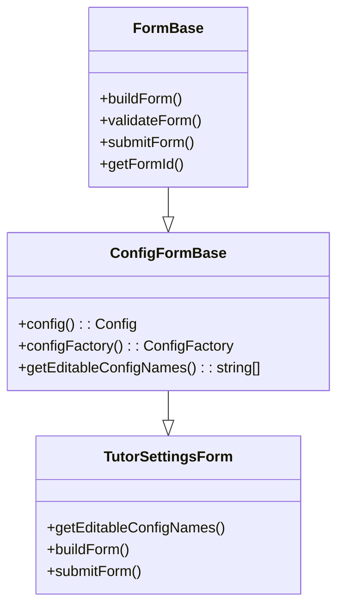

**Ventajas:**

| Feature | FormBase | ConfigFormBase |
|---------|----------|----------------|
| `$this->config('name')` | Manual | Helper |
| `$this->configFactory()` | Manual | Helper |
| Guarda config automático | No | En `parent::submitForm()` |
| `getEditableConfigNames()` | No existe | Obligatorio |
| Permisos admin | Manual | Ruta usa `administer site configuration` |

### Flujo de guardado

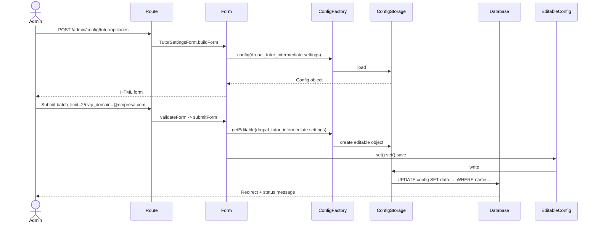

### Configuración creada (`hook_install`)

```php
function drupal_tutor_intermediate_install() {
  \Drupal::service('config.factory')->getEditable('drupal_tutor_intermediate.settings')
    ->set('batch_limit', 50)
    ->set('vip_domain', '@mipropio.com')
    ->save(TRUE);
}
```

**Archivo generado:**
```yaml
batch_limit: 50
vip_domain: '@mipropio.com'
```

---

## Control de acceso personalizado (VIP)

### Archivo: `src/Access/VipAccessCheck.php`

```php
class VipAccessCheck {
  protected $currentUser;
  protected $configFactory;

  public function __construct(AccountInterface $currentUser, ConfigFactoryInterface $configFactory) {
    $this->currentUser = $currentUser;
    $this->configFactory = $configFactory;
  }

  public function access(AccountInterface $account) {
    if ($account->isAnonymous()) {
      return AccessResult::forbidden()->addCacheableDependency($account);
    }

    $email = $account->getEmail();
    $config = $this->configFactory->get('drupal_tutor_intermediate.settings');
    $required_domain = $config->get('vip_domain');

    if (empty($required_domain)) {
      return AccessResult::forbidden()->addCacheableDependency($config);
    }

    if (str_ends_with($email, $required_domain)) {
      return AccessResult::allowed()->addCacheableDependency($config);
    }

    return AccessResult::forbidden('No tienes acceso a esta zona')->addCacheableDependency($config);
  }
}
```

### Registro como servicio (`services.yml`)

```yaml
services:
  drupal_tutor_intermediate.custom_access:
    class: Drupal\drupal_tutor_intermediate\Access\VipAccessCheck
    arguments: ['@current_user', '@config.factory']
```

### Ruta con `_custom_access` (`routing.yml`)

```yaml
drupal_tutor_intermediate.vip_area:
  path: '/tutor/intermedio/zona-vip'
  defaults:
    _controller: 'Drupal\drupal_tutor_intermediate\Controller\VipController::content'
    _title: 'Zona VIP'
  requirements:
    _custom_access: 'drupal_tutor_intermediate.custom_access:access'
```

### Servicio vs Clase estática

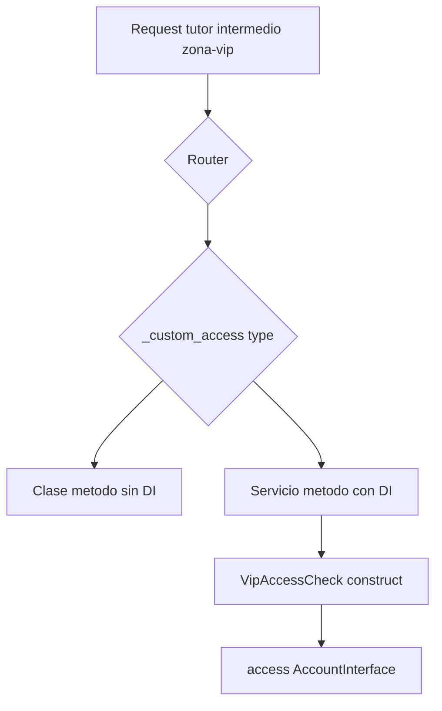

| Sintaxis | Inyección | Uso típico |
|----------|-----------|------------|
| `'Clase::metodo'` | No | Access checks simples |
| `'servicio:metodo'` | Si | Access checks con config, BD |

### `AccessResult` y Cacheabilidad

```php
// CORRECTO
return AccessResult::allowed()->addCacheableDependency($config);

// INCORRECTO
return AccessResult::allowed();
```

**Cache tags:**
- `$account` → `user:<uid>` + `user.roles:authenticated`
- `$config` → `config:drupal_tutor_intermediate.settings`

### Flujo completo VIP Access

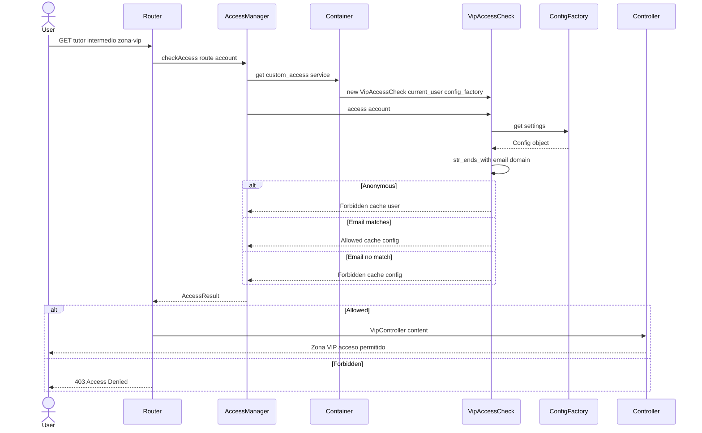

---

## EntityQuery avanzada

### Archivo: `src/Services/NodeProcessor.php`

```php
public function getNodesToProcess(): array {
  $storage = $this->entityTypeManager->getStorage('node');

  $query = $storage->getQuery()
    ->condition('type', 'article')
    ->condition('status', 1)
    ->condition('title', '%[[]ACTUALIZADO[]]%', 'NOT LIKE')
    ->accessCheck(FALSE);
  return $query->execute();
}
```

### Análisis de la query

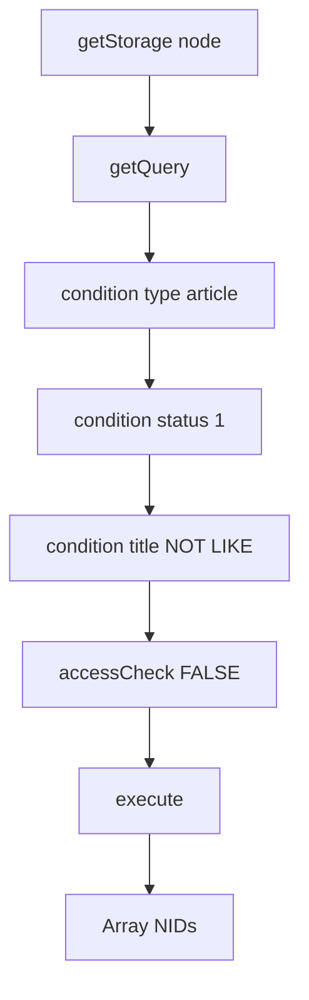

**Escape de corchetes en LIKE:**
- `[` y `]` son comodines en SQL LIKE
- Para buscar literal `[ACTUALIZADO]`: escapar como `[[]ACTUALIZADO[]]`
- Drupal/PDO traduce a: `title NOT LIKE '%[ACTUALIZADO]%'`

**`accessCheck(FALSE)`** — Saltar node_access. Proceso batch es admin.

### SQL generado aproximado

```sql
SELECT nid
FROM node_field_data
WHERE type = 'article'
  AND status = 1
  AND title NOT LIKE '%[ACTUALIZADO]%' ESCAPE '\'
```

---

## Batch API

### Archivo: `src/Form/BatchUpdateForm.php`

```php
public function submitForm(array &$form, FormStateInterface $form_state) {
  $nids = $this->nodeProcessor->getNodesToProcess();
  $limit = $this->config('drupal_tutor_intermediate.settings')->get('batch_limit') ?? 50;

  $chunks = array_chunk($nids, $limit);

  $batch = (new BatchBuilder())
    ->setTitle($this->t('Actualizando Articulos generados por Devel'))
    ->setFinishCallback([NodeProcessor::class, 'finishBatch'])
    ->setInitMessage($this->t('Iniciando...'))
    ->setProgressMessage($this->t('Procesando lote @current de @total.'));

  foreach ($chunks as $chunk) {
    foreach ($chunk as $nid) {
      $batch->addOperation([NodeProcessor::class, 'processBatchItem'], [$nid]);
    }
  }

  $form_state->set('batch', $batch->toArray());
}
```

### Archivo: `src/Services/NodeProcessor.php` — Callbacks

```php
public static function processBatchItem($nid, $context) {
  $storage = \Drupal::entityTypeManager()->getStorage('node');
  $node = $storage->load($nid);

  if ($node) {
    $old_title = $node->getTitle();
    $node->setTitle('[ACTUALIZADO] ' . $old_title);
    $node->save();

    $context['message'] = 'Actualizando nodo ID: ' . $nid;
    $context['results'][] = $nid;
  }
}

public static function finishBatch($success, $results, $operations) {
  $messenger = \Drupal::messenger();
  if ($success) {
    $count = count($results);
    $messenger->addStatus('Exito! se actualizaron ' . $count . ' resultados.');
  } else {
    $messenger->addError('Ha ocurrido un error actualizando los resultados.');
  }
}
```

### Arquitectura Batch API

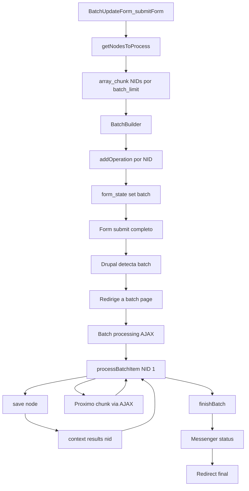

### `BatchBuilder` vs `batch_set()` legacy

| Método | Drupal 8/9 | Drupal 10+ | Form submit |
|--------|------------|------------|-------------|
| `batch_set($batch)` | Si | Deprecated | No |
| `form_state.set('batch')` | No | Recomendado | Si |
| `BatchBuilder` (fluent) | Si | Si | Si |

### Procesamiento por chunks

```php
$nids = [1,2,3,4,5,6,7,8,9,10];
$limit = 3;
$chunks = array_chunk($nids, 3);
// [[1,2,3], [4,5,6], [7,8,9], [10]]
// 10 operaciones en 4 requests AJAX
```

---

## Hooks de instalación

### Archivo: `drupal_tutor_intermediate.module`

```php
function drupal_tutor_intermediate_install() {
  \Drupal::service('config.factory')->getEditable('drupal_tutor_intermediate.settings')
    ->set('batch_limit', 50)
    ->set('vip_domain', '@mipropio.com')
    ->save(TRUE);
}

function drupal_tutor_intermediate_uninstall() {
  \Drupal::service('config.storage')->delete('drupal_tutor_intermediate.settings');
}
```

### Flujo de instalación

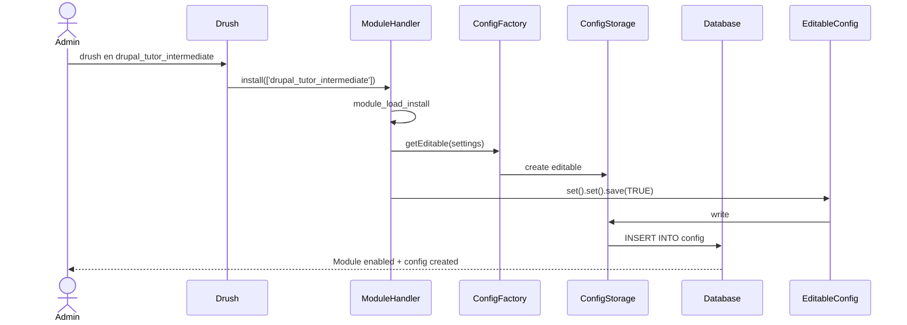

### `save(TRUE)` — Skip schema validation

```php
// TRUE = confía en instalación nueva, no valida schema
->save(TRUE);

// FALSE (default) = valida contra config/schema/*.yml
->save(FALSE);
```

---

## Diagramas de flujo

### 1. Arquitectura general del módulo

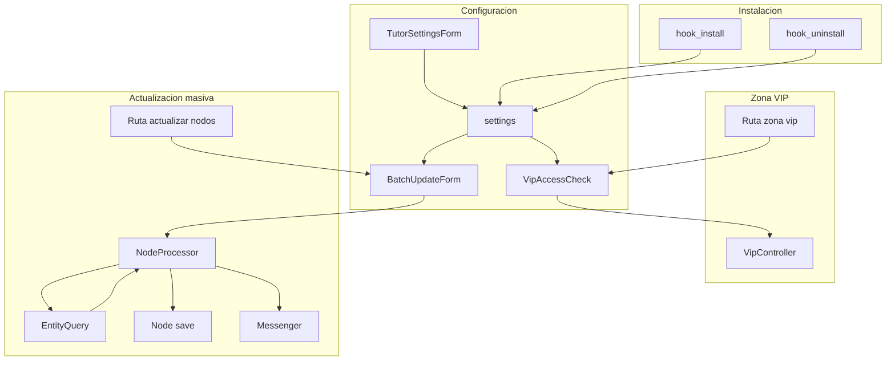

### 2. Flujo Batch API detallado

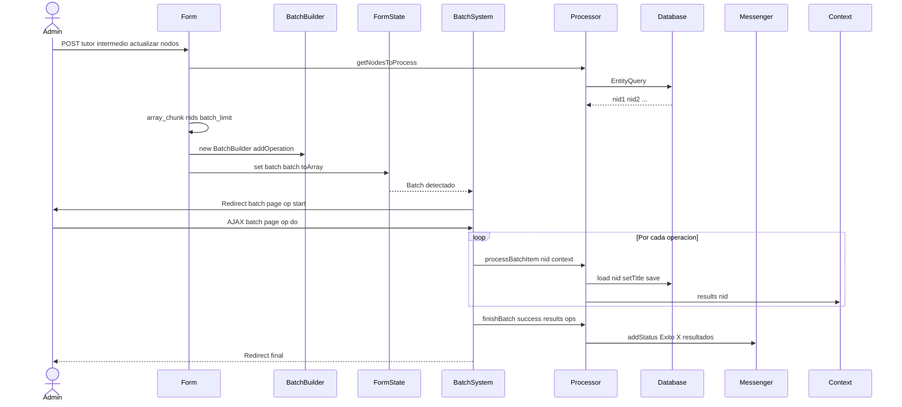

### 3. Access Check con cache tags

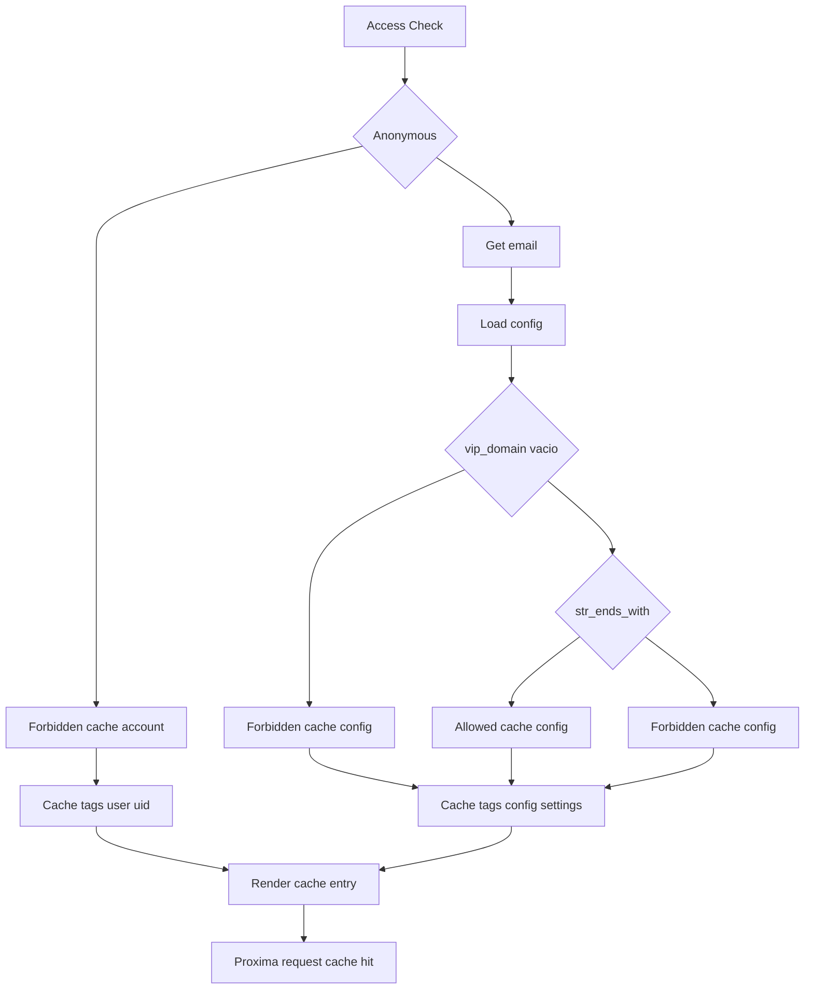

### 4. EntityQuery con escape LIKE

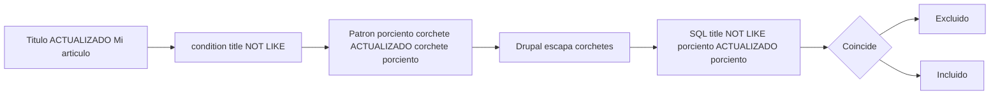

### 5. hook_install con save(TRUE)

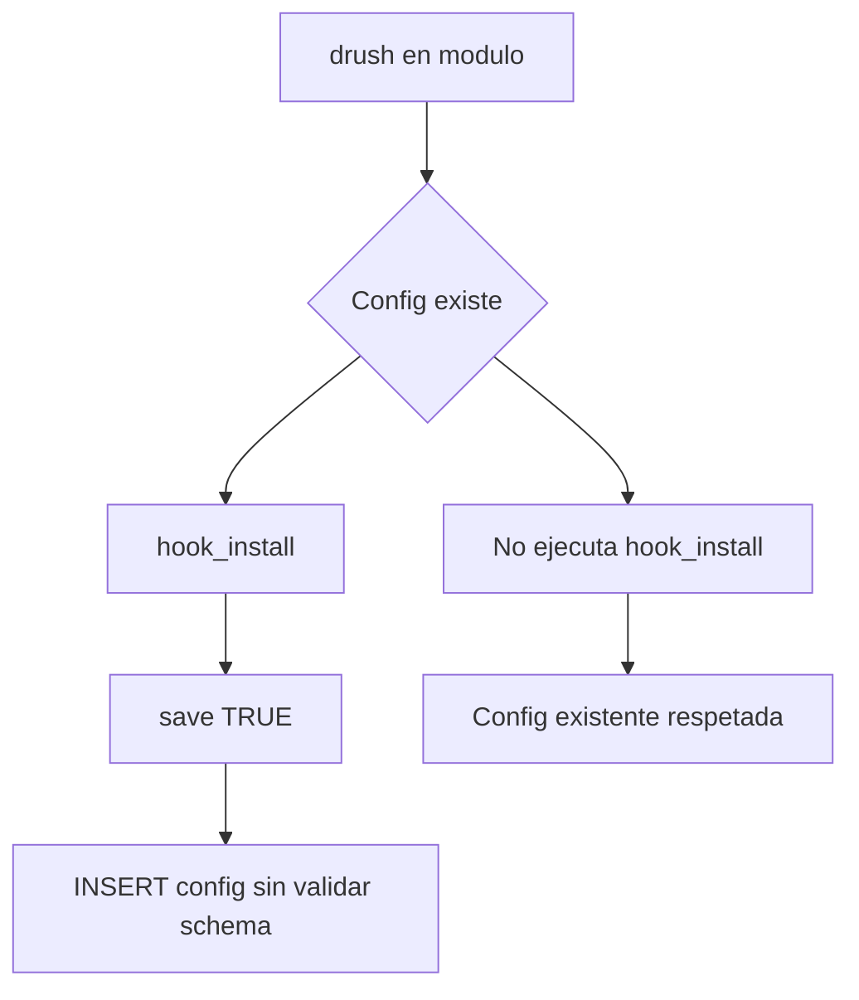

---

## Decisiones de diseño

### 1. `_custom_access` con servicio inyectado

| Opción | Pros | Contras |
|--------|------|---------|
| `_permission` | Simple | No permite logica dinamica |
| `_role` | Simple | Muy grueso |
| `_access: 'TRUE'` | Abierto | Sin control |
| `_custom_access: 'Clase::metodo'` | Sin container | Sin DI |
| **`_custom_access: 'servicio:metodo'`** | **DI completo** | **Ligeramente verbose** |

### 2. `ConfigFormBase` vs `FormBase` + config manual

**ConfigFormBase gana:** helpers, validación schema, permisos admin por defecto.

### 3. Batch callbacks `static` vs inyectados

```php
// Static (estándar Drupal Batch)
public static function processBatchItem($nid, $context) {
  $storage = \Drupal::entityTypeManager()->getStorage('node');
  ...
}
```

**Por qué static:** Batch API serializa operaciones; en cada request AJAX se re-instancia. `static` no requiere serializar el objeto.

### 4. `array_chunk` para lotes (1 operación por NID)

- Progreso granular (barra avanza por NID)
- `context['message']` muestra NID actual
- Fallo en 1 NID no afecta a otros

---

## Cómo probar

```bash
fin exec drush cr
fin exec drush en drupal_tutor_intermediate -y

# 1. Configuración
# Navegador: /admin/config/tutor/opciones

# 2. Zona VIP
# Usuario con email @ejemplo.com -> /tutor/intermedio/zona-vip -> ACCESO
# Usuario con @otro.com -> 403

# 3. Batch Update
# drush genc 20 --types=article
# Navegador: /tutor/intermedio/actualizar-nodos

# 4. Logs
# /admin/reports/dblog -> Type: drupal_tutor_intermediate
```

---

## Referencias técnicas

- [ConfigFormBase](https://api.drupal.org/api/drupal/core%21lib%21Drupal%21Core%21Form%21ConfigFormBase.php/class/ConfigFormBase)
- [Access System](https://www.drupal.org/docs/drupal-apis/access-api)
- [Batch API](https://www.drupal.org/docs/drupal-apis/batch-api)
- [EntityQuery](https://www.drupal.org/docs/drupal-apis/entity-api/entity-query)
- [hook_install](https://api.drupal.org/api/drupal/core%21lib%21Drupal%21Core%21Extension%21module.api.php/function/hook_install)
- [Cacheability Metadata](https://www.drupal.org/docs/drupal-apis/cache-api/cacheable-dependencies)